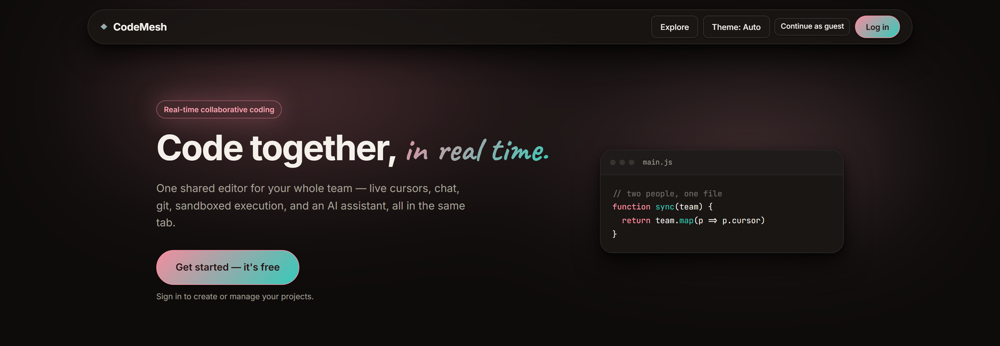
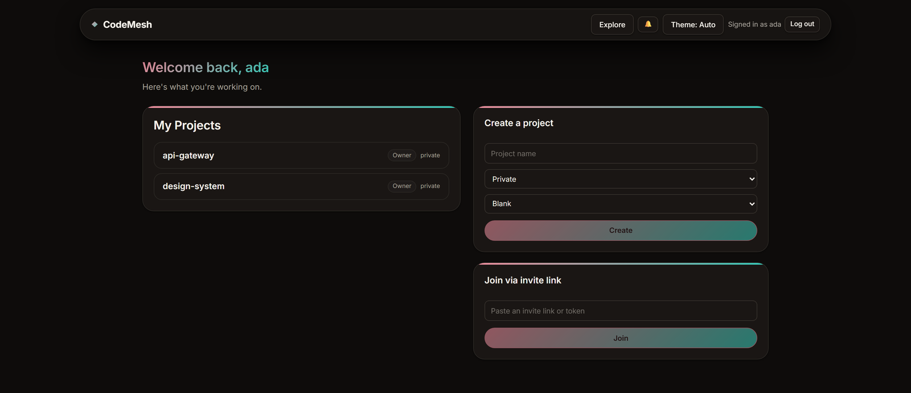
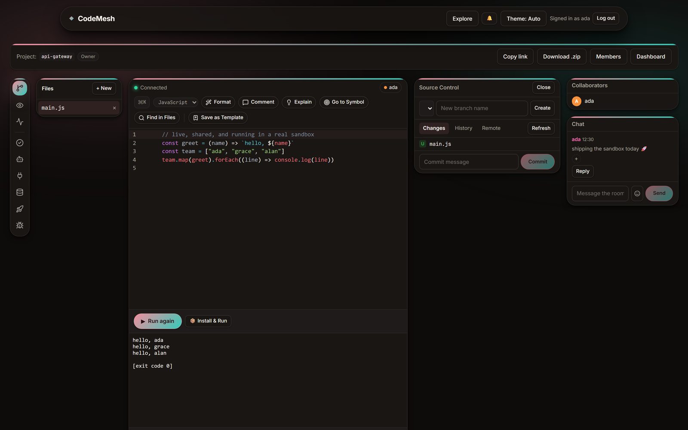

# CodeMesh

**[▶ Try it live — codemesh.pages.dev](https://codemesh.pages.dev)**

A real-time collaborative code editor. Several people open the same project and edit it at once — live cursors, presence, chat, and inline comment threads — with a full toolchain in the same tab: sandboxed execution with an interactive terminal, real step-through debugging, Git with pull requests, a Postgres query panel, an HTTP API tester, one-click deploys, and an AI assistant.



> The live instance runs on free infrastructure — a 1 GB VM for the server
> and Piston, with the client on a CDN. It's sized for a demo rather than a
> crowd, so expect code execution to take a few seconds.

## Features

**Collaboration**
- Live multi-cursor editing backed by [Yjs](https://docs.yjs.dev/) CRDTs — no operational-transform server, no lock contention, and edits merge cleanly even after a disconnect
- Presence avatars, join/leave toasts, and a per-room chat with @mentions, threaded replies, and emoji reactions
- Inline comment threads anchored to code ranges, with resolve and reactions
- An activity log of file, commit, and membership events
- Notifications for mentions

**Editing**
- Multi-file projects with a shared file tree
- Autocomplete, Go to Symbol, Ctrl+click go-to-definition, and Find in Files — all indexed across every file in the project, not just the open one
- A command palette (`⌘K` / `Ctrl+K`)
- Server-side formatting per language
- Save any project as a reusable template

**Running code**
- **Run** — executes against a self-hosted [Piston](https://github.com/engineer-man/piston) runtime with an interactive stdin terminal, so programs that prompt for input actually work
- **Install & Run** — resolves npm dependencies inside a container
- **Debug** — real step-through debugging over the Chrome DevTools Protocol: breakpoints, logpoints, step-over, resume, and live inspection of variables in scope, against an actual Node process paused in a container
- **Tests** — runs a test file and reports pass/fail per case

**Git**
- Commit, branch, diff, and browse history without leaving the editor
- Review requests with a diff against a base branch, and approvals
- Push to a GitHub remote, and list or open real pull requests through the GitHub API
- **Automatic checkpoints** — uncommitted live edits are periodically committed on their own, so "restore a previous version" can reach work nobody thought to commit

**Everything else**
- Postgres query panel (read-only, connection string entered per session and never stored)
- HTTP API test panel
- Deploy a static site or a Node server to a live URL, backed by a real container
- AI assistant for room-wide questions, plus **Explain** on any selection
- Roles (`viewer` / `editor` / `admin` / `owner`), invite links scoped to a role, public/private projects, and a public gallery
- Export any project as a `.zip`
- Light / dark / system themes

### Dashboard



### Workspace

The activity rail on the left switches the side panel — one at a time, like an IDE sidebar. Here Source Control is open next to a run that has just finished.



## How work is saved

There's no save button, and three separate things are happening:

1. **Live edits persist continuously.** Every keystroke is a Yjs update
   synced to the server and written to LevelDB under `server/data`. That
   covers files, chat, comments and the activity log alike — they're all
   Yjs types — and it survives a server restart.
2. **Uncommitted work becomes git commits on its own**, so "restore a
   previous version" can reach edits nobody committed manually. Worth
   knowing how it triggers: checkpoints piggyback on git operations
   (opening Source Control, refreshing status, switching branches) rather
   than a background timer, with a 5-minute floor between them. **Never
   open Source Control and no automatic commits are made** — the work is
   still safe under (1), there just aren't restore points.
3. **Manual commits**, through the Source Control panel.

What isn't persisted: run output, deploy previews (a point-in-time
snapshot, torn down on Stop), and rate-limit counters (in-memory by
design). A project's entire state lives in `server/data`, `server/repos`,
and the `*.json` files beside them — worth knowing if you ever want to back
one up.

## Security

The server executes code that strangers submit, so a public instance leans
on a few things:

- **Piston sandboxes execution**, and the containerised features (Deploy,
  Install & Run, Debug) get capped memory, CPU and process counts on an
  isolated Docker network, with a hard limit on concurrent deploys.
- **Rate limiting** (`server/rateLimit.js`) by class of work — stricter for
  auth than for reads, stricter still for anything that starts a container
  or calls a paid API. Counters are per-process and in memory, so running
  more than one server process needs them moved to shared storage.
- **An SSRF guard** (`server/ssrfGuard.js`) on the Database panel. That
  feature makes the server open an outbound connection to whatever host the
  caller typed, which on a public box turns it into a probe for anything it
  can reach that the caller can't — other containers, the host itself, and
  cloud metadata endpoints that hand out instance credentials. Connections
  are refused unless the host resolves to a publicly routable address.

Two variables switch protections off for local development
(`ALLOW_PRIVATE_DB_HOSTS`, `RATE_LIMIT_DISABLED`). Both default to off, so
a deployment is protected unless someone deliberately opts out.

## Languages

**JavaScript, TypeScript, Python, Java, C++, Rust,** and **Go** — each backed by a real Piston runtime, with server-side formatters (Prettier, `black`, `gofmt`, `rustfmt`, `clang-format`, `google-java-format`) behind the Format button.

## Stack

- **Client** — React 19 + TypeScript, Vite, CodeMirror 6 (via `y-codemirror.next`), and a design system of HSL CSS custom properties driving light/dark themes (Tailwind is configured and available, but the components are styled with the hand-written stylesheet)
- **Server** — Node.js, `ws` + `y-websocket`, with accounts/projects/invites/notifications in plain JSON files
- **Sync** — Yjs CRDTs over WebSocket. Every document, chat thread, comment, and activity entry is a shared Yjs type, so the server stays a relay rather than a source of truth
- **Execution** — a self-hosted Piston instance; the containerised features (Deploy, Install & Run, debugging) shell out to the `docker` CLI on the host
- **AI** — Google Gemini

## Prerequisites

- Node.js 18+
- **Docker**, for Deploy, Install & Run, and step-through debugging
- A **Piston** instance for Run / Format / Tests — reachable at `localhost:2000` by default
- A reachable **Postgres** instance, only for the Database panel (the connection string is entered in the UI; nothing to configure server-side)
- A [**Gemini API key**](https://aistudio.google.com/apikey) for the AI Assistant and Explain (free tier, no card required)

None of these are hard requirements to boot the app — without them, the corresponding features surface a clear "not configured" error and everything else keeps working.

## Setup

```bash
cd server && npm install
cd ../client && npm install
```

### Environment variables

Copy `server/.env.example` to `server/.env`. Every variable is optional and falls back to a working default:

| Variable | Default | Purpose |
| --- | --- | --- |
| `PORT` | `1234` | Server port |
| `CLIENT_URL` | `http://localhost:5173` | Used to build links inside password-reset emails |
| `GEMINI_API_KEY` | — | Enables the AI Assistant and Explain |
| `GEMINI_MODEL` | `gemini-3.8-flash` | Model used for AI features |
| `RESEND_API_KEY` | — | Enables password-reset emails ([Resend](https://resend.com/api-keys) sandbox sending needs no DNS setup) |
| `RESEND_FROM` | `CodeMesh <onboarding@resend.dev>` | From address for those emails |
| `PISTON_WS_URL` | `ws://localhost:2000/api/v2/connect` | Interactive runs (stdin) |
| `PISTON_HTTP_URL` | `http://localhost:2000/api/v2/execute` | Test runs |
| `YPERSISTENCE` | `server/data` | On-disk Yjs document storage |
| `TRUST_PROXY` | off | Set to `1` only when behind a reverse proxy, so rate limiting uses `X-Forwarded-For` rather than the proxy's own address |
| `ALLOW_PRIVATE_DB_HOSTS` | off | Set to `1` to let the Database panel reach loopback/private addresses. For local development only — leave off anywhere public |
| `RATE_LIMIT_DISABLED` | off | Set to `1` to switch request limiting off entirely. Exists for the end-to-end suite, which signs up an account per spec from one address. Never set it on a public instance |

The client reads one variable, `VITE_SERVER_URL` (default `http://localhost:1234`) — set it to point a build at a non-local server.

### Piston

```bash
docker run -d --name piston_api --privileged \
  -p 127.0.0.1:2000:2000 -v piston_packages:/piston/packages \
  -e PISTON_RUN_TIMEOUT=20000 -e PISTON_COMPILE_TIMEOUT=60000 \
  ghcr.io/engineer-man/piston
```

Bind it to `127.0.0.1`: Piston executes arbitrary code with no
authentication, so anything that can reach it owns the machine.

The raised timeouts matter on a small or shared-CPU host. Piston's defaults
(3s run, 10s compile) assume a normal processor, and where wall clock runs
ahead of CPU time — a Go hello-world measured 133 ms of CPU against 5 s of
wall clock on a shared vCPU — Go and Java get SIGKILLed mid-run and return
no output, which reads like a crash rather than a timeout.

Then install the runtimes. The package names don't always match the
language: **JavaScript installs as `node`, C++ as `gcc`**, and the versions
must match those pinned in `server/languages.js` or Run reports an unknown
runtime.

```bash
for pkg in "node 18.15.0" "typescript 5.0.3" "python 3.10.0" \
           "gcc 10.2.0" "go 1.16.2" "java 15.0.2" "rust 1.68.2"; do
  set -- $pkg
  curl -s -X POST http://127.0.0.1:2000/api/v2/packages \
    -H 'Content-Type: application/json' \
    -d "{\"language\":\"$1\",\"version\":\"$2\"}"
done
```

Formatters are separate. Go, Rust and C++ are formatted by whichever
binaries are on the host's `PATH`, falling back to `docker exec`-ing into
the Piston container when there are none — so this script has to run on
whichever machine holds that container:

```bash
cd server && npm run setup-formatters
```

Python's formatter needs `python` on the `PATH` (Ubuntu ships only
`python3`; `python-is-python3` provides it) and Java's needs a JDK **no
newer than 21** — `google-java-format` calls javac internals that JDK 25
changed.

## Running

In two terminals:

```bash
cd server && npm start    # ws://localhost:1234
cd client && npm run dev  # http://localhost:5173
```

Open `http://localhost:5173`, sign up, and create a project. To try collaboration, open the same project in a second browser profile, or generate an invite link from **Members**.

## Testing

A Playwright end-to-end suite of **72 specs** drives the real client and server together — two browser contexts editing simultaneously, real containers, real git operations:

```bash
cd client && npx playwright test
```

Some specs need supporting services: Piston (Run/Format/Test), Docker (Deploy/Debug), a Postgres instance seeded with a `widgets` table (Database panel), and API keys for the AI and password-reset specs. Without those, the corresponding specs fail while the rest of the suite passes.

**Stop your dev server first.** Playwright starts the app itself and passes
two environment variables the suite depends on — it disables rate limiting
(every spec signs up an account from the same address) and allows the
Database panel to reach localhost. It reuses an already-running server if it
finds one, and that server won't have those variables, so most specs fail in
confusing ways.

## Deploying

Full walkthrough in **[docs/DEPLOY.md](docs/DEPLOY.md)**, including a free
hosting route. The short version: the client is a static bundle that hosts
free anywhere, while the server needs a Linux VM with Docker — it drives
the host's Docker daemon for deploy previews, Install & Run, and debugging,
which managed platforms don't allow.

On a fresh Ubuntu VM, one command does the whole server build — packages,
Node, a service user, Piston, systemd, nginx and the firewall:

```bash
git clone https://github.com/lordflaxko/CodeMesh-Collab-Code-Editor.git
sudo bash CodeMesh-Collab-Code-Editor/deploy/setup.sh your-hostname.example.com
```

It stops short of certbot (which needs live DNS) and `.env` (which needs
your keys), printing both as next steps. Prefer **x86**: Piston publishes an
`amd64`-only image, so an ARM host has to run it on a separate machine or
under emulation.

The client builds separately, and `VITE_SERVER_URL` is inlined at build
time — so it must be set before building, and changing it means rebuilding:

```bash
cd client && VITE_SERVER_URL=https://your-hostname.example.com npm run build
```

`netlify.toml` in the repo root configures Netlify for this; set
`VITE_SERVER_URL` in the site's environment variables and connect the repo.

### Updating a deployment

The client redeploys on push, building the new version while the old one
keeps serving. For the server:

```bash
sudo bash /opt/codemesh/deploy/update.sh
```

That pulls, reinstalls dependencies only when the lockfile changed,
restarts, and polls the health endpoint — systemd reports `active` for a
moment even when the process is restarting into a crash loop, so its word
alone isn't proof. Expect about 3 seconds of interruption: WebSockets drop
and reconnect on their own, and nothing is lost.

## Project structure

```
client/   React app — editor, panels, routing, design system
  src/
  tests/  Playwright end-to-end suite
server/   WebSocket collaboration server + REST endpoints
          (accounts, projects, git, deploy, database, AI, email)
deploy/   setup.sh, update.sh, nginx and systemd config
docs/     DEPLOY.md and screenshots
```
